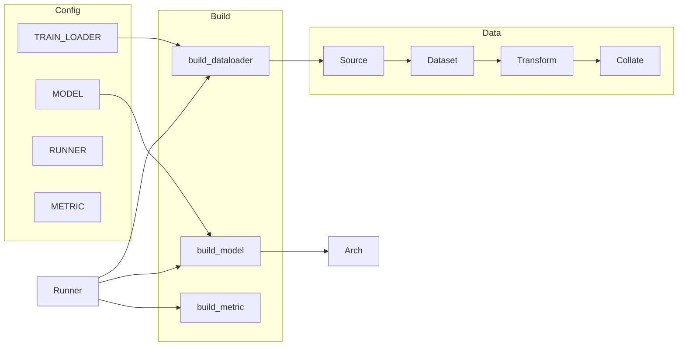

# SLIMAI

SLIMAI is a comprehensive deep learning framework designed to accelerate model development across various tasks including classification, detection, and segmentation. Built with flexibility and efficiency in mind, it leverages PyTorch & MMEngine for optimized training pipelines, with a focus on **pathology applications** (e.g. TCT, Stomach, IHC, Thyroid) and **Multiple Instance Learning (MIL)** for whole-slide or bag-level prediction.

## Features

### Core Capabilities
- **Unified Training Pipeline**: Config-driven training with `tools/run.py --config <template>.py`
- **Multi-Task Support**:
  - Classification
  - Object Detection
  - Self-Supervised Learning (e.g. DINO)
  - **MIL** (bag-of-instances → slide/cell-level labels)
  - Extensible for custom tasks

### Development Tools
- **Modular Architecture**: Flexible data pipeline, pluggable model components (backbone/neck/head), extensible runner and hooks
- **Registry-Based Build**: MMEngine `TRANSFORMS` / `DATASETS` / `MODELS` / `OPTIMIZERS` + project `LOADERS` / `SOURCES` / `VISUALIZERS`; extend via `@REGISTER` and `type=` in config
- **Training**: Distributed (DDP/FSDP), AMP, gradient accumulation/clip, checkpoint & resume, SwanLab logging

### Data Processing
- **Sources**: LocalSource, SheetSource (Excel), TorchSource (e.g. MNIST)
- **Datasets**: BasicDataset, Supervised/UnSupervised, MILDataset, **H5Dataset** (precomputed embeddings)
- **Transforms**: TorchTransform, MILTransform (tiling/augment), DINOTransform, AlbuTransform, **EmbeddingAugmenter** (for MIL)
- **Loaders/Collate**: RegionTileLoader (WSI), RandomTileLoader, DataCollate, **MILCollate**

---

## Project Structure

### Root Layout

| Path | Purpose |
|------|--------|
| `slimai/` | Main package: `data`, `helper`, `models`, `runner`, `templates` |
| `tools/` | Entry scripts: `run.py` (train/infer/evaluate), `export.py` |
| `chore/` | Build/setup (e.g. `setup.py`) |
| `docs/` | Documentation |
| `scripts/` | Utilities (e.g. `train_sft.py`, `make_sft.py`, `create.py`) |
| `_debug_/` | Debug/experiment dirs (e.g. thca, mpp-unify-vis), not core code |

### Main Package `slimai`

- **data**: Source → Dataset → Transform → Loader/Collate
- **helper**: Build (help_build), distributed, checkpoint, Record (SwanLab), DataSample, utils
- **models**: Arch (task), component (backbone/neck/head), losses, metric, portation, feature
- **runner**: Train/infer/evaluate loop and exporter

Config templates live in `slimai/templates/` (e.g. `classify.py`, `dino.py`, `h5_mil.py`, `wsi_mil.py`) and are run via `tools/run.py --config <template>.py`.

---

## Configuration & Pipeline

### Entry & Config Convention

- **Entry**: `tools/run.py` parses `--config` (Python config file), `--tag`, `--work_dir`, `--action` (train/infer/evaluate), distributed and precision options.
- **work_dir**: CLI overrides config; if not set, uses `experiments/{stem}/{signature}-{tag}` where `signature` is MD5 of (TRAIN_LOADER + MODEL).
- **Config sections** (see e.g. `slimai/templates/h5_mil.py`):
  1. **DATASET**: Data source, augmentation, sampling
  2. **TRAIN/VALID/TEST_LOADER**: dataset + batch_size, num_workers, collate_fn
  3. **MODEL**: arch type + backbone/neck/head/loss/solver
  4. **RUNNER**: max_epoch, gradient (amp/clip), logger, ckpt, resume
  5. **METRIC**: e.g. Accuracy, AUROC, CohenKappa
  6. Meta: `_PROJECT_`, `_EXPERIMENT_`, `signature`

### Build Flow

- **Component build**: `compose_components(cfg, source=...)` tries IMPORT then the given Registry (e.g. MODELS); supports recursive (e.g. scheduler).
- **Key builders**: `build_dataloader` → `build_dataset` + optional `build_loader(collate_fn)`; `build_model` / `build_loss` / `build_solver` (with scheduler) / `build_metric` / `build_visualizer`.
- **Runner**: `Runner(cfg)` builds dataloaders, arch (model/solver/scheduler/loss), metric; loads checkpoint; prepares distributed; `run(action)` runs train/infer/evaluate. Training uses `arch(..., mode="loss")`, `Gradient.step`, and arch hooks (`epoch_precede_hooks`, `step_precede_hooks`, etc.). **Record** (singleton) logs to SwanLab on a single process.

### Data Flow (high-level)



---

## Architecture & Design

### Model Layers

- **BaseArch** (`slimai/models/arch/base_arch.py`): Base class for `init_layers(backbone, neck, head)`, `init_solver`, `init_loss`, `compile`/`checkpointing`, `extract()`; subclasses implement `_forward_tensor` / `_postprocess` and hooks.
- **Pipeline** (`slimai/models/component/pipeline.py`): Default `backbone → neck → head` chain for generic classification.
- **Task Archs**: **ClassificationArch** (logits/softmax/labels); **MIL** (bag-of-instances, `embedding_group_size`, optional freeze_backbone, backbone → neck → head); **DINO**; **DetectionArch**.
- MIL necks in `slimai/models/component/kmil.py`: **WMIL**, **SortWMIL**, **THCAHeadC3**, etc., aligned with pathology (e.g. TBS/BRAF) labels.

### Pathology & MIL

- **Use case**: Pathology (TCT, Stomach, IHC, Thyroid) with emphasis on **MIL** (slide or bag → slide/cell-level label).
- **Two MIL data paths**:
  - **WSI path** (`slimai/templates/wsi_mil.py`): SheetSource (Excel: wsi_path, label, phase) → MILDataset → RegionTileLoader + MILTransform (tile_size, stride, individual/group augment) → MILCollate.
  - **H5 path** (`slimai/templates/h5_mil.py`): pkl index + H5 precomputed features (e.g. `.kfb_feat_UNI_GRAY`) → H5Dataset (optional EmbeddingAugmenter, balance) → MILCollate; backbone can be `torch.nn.Identity` to train only neck+head.
- **Labels & metrics**: TBS-style multi-class mapping (2C/3C/4C), Cohen Kappa, AUROC, Accuracy; optional Focal Loss and class balance.

### Extensibility

- New **DataSource/Dataset/Transform** → register to DATASETS, TRANSFORMS.
- New **Model/Loss/Metric** → register to MODELS.
- New **Collate** → register to LOADERS.
- New **Arch** → subclass BaseArch and register; then reference by `type=` in config without changing the runner.

---

## Key Files

| Role | Paths |
|------|--------|
| Entry & run | `tools/run.py`, `slimai/runner/runner.py` |
| Build & registry | `slimai/helper/help_build.py` |
| Arch & MIL | `slimai/models/arch/base_arch.py`, `slimai/models/arch/mil.py` |
| MIL data & augment | `slimai/data/dataset/h5_dataset.py`, `slimai/data/transform/embedding_augmenter.py`, `slimai/data/loader/region_tile_loader.py` |
| Config templates | `slimai/templates/h5_mil.py`, `slimai/templates/wsi_mil.py`, `slimai/templates/classify.py` |

---

## Usage

### Quick Start

1. Install dependencies:
```bash
pip install -r requirements.txt
```

2. Run training on single GPU:
```bash
python tools/run.py --config slimai/templates/dino.py
```

3. Run training on multiple GPUs:
```bash
bash scripts/run_ddp.sh slimai/templates/dino.py
```

### Examples by task

- **Classification (MNIST)**: `python tools/run.py --config slimai/templates/classify.py`
- **MIL (H5 embeddings)**: `python tools/run.py --config slimai/templates/h5_mil.py` (set `DATASET_FILE` and split keys in config)
- **MIL (WSI)**: `python tools/run.py --config slimai/templates/wsi_mil.py` (set sheet path and columns in config)
